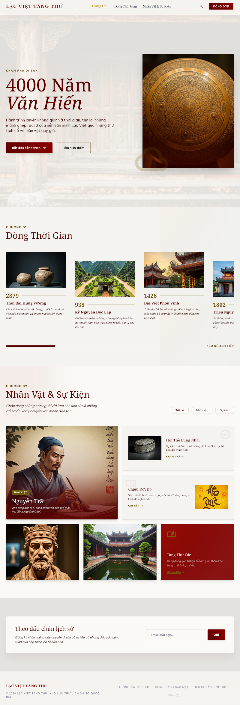
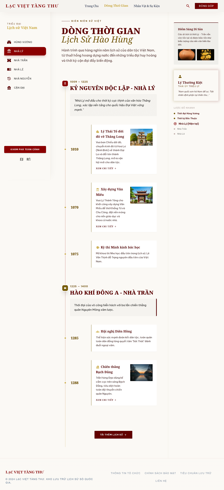
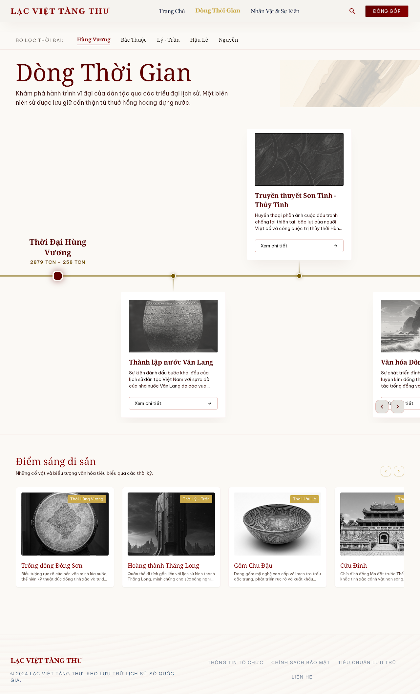
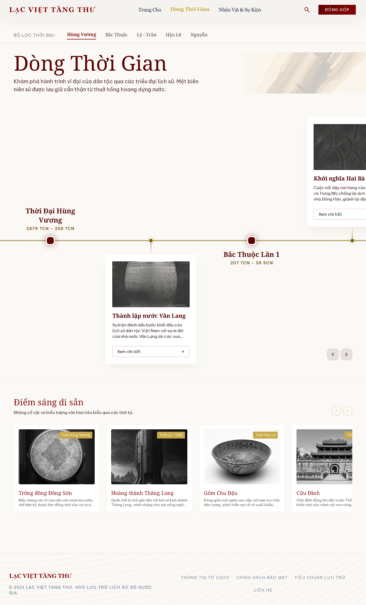
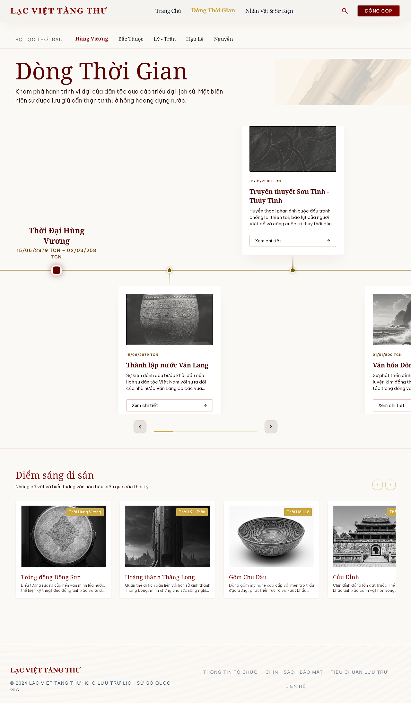
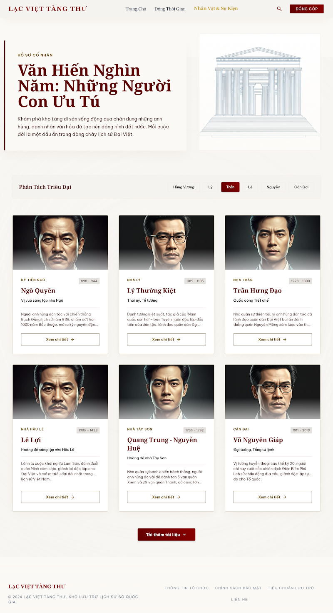
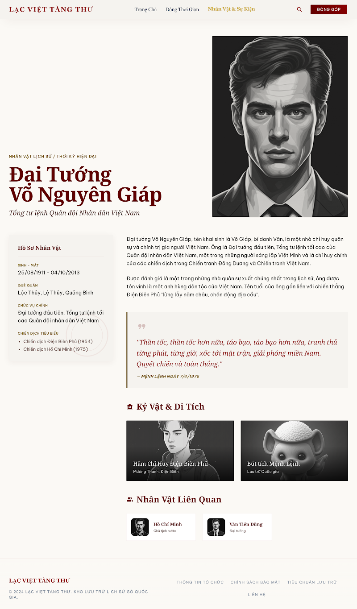

# Stitch Design Screenshots

## Home

## Timeline — Screen 1: Căn chỉnh Node (dọc, 3 cột)

## Timeline — Screen 2: Ngang - Xen kẽ Trên Dưới

## Timeline — Screen 3: Ngang - Đồng bộ Header & Footer

## Timeline — Screen 4: Định dạng Ngày Tháng (dd/mm/yyyy)

## Nhân Vật & Sự Kiện

## Chi Tiết Nhân Vật

## Chi Tiết Sự Kiện

